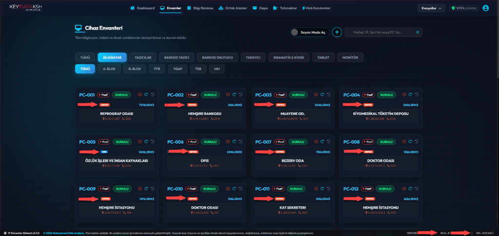
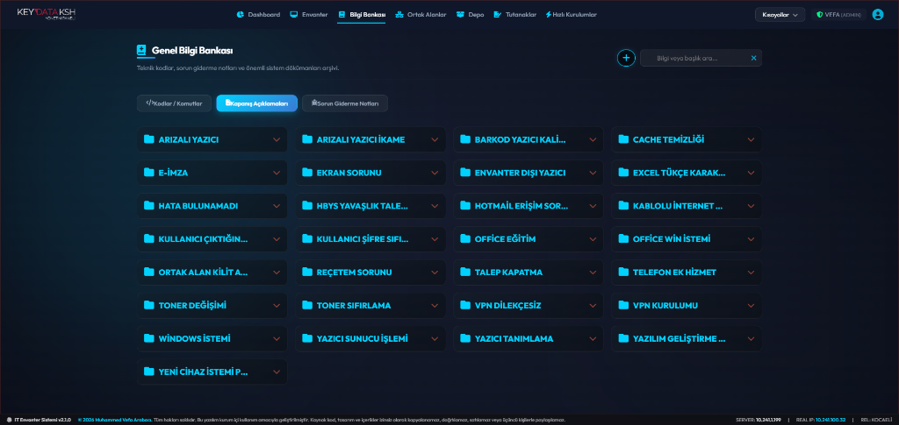
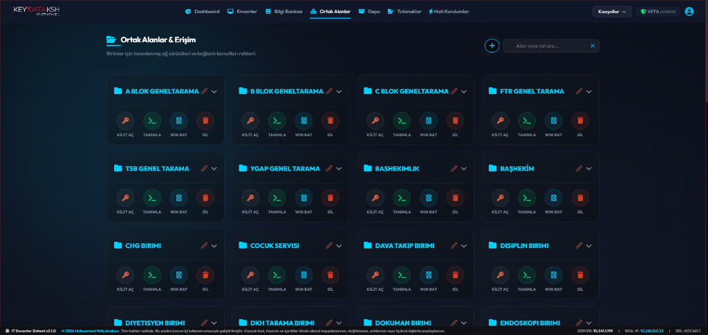

  <h1>🏥 IT Demirbaş ve Envanter Yönetim Sistemi</h1>

  

    
    
    
  

  

    <strong>Büyük ölçekli kurumsal ağlarda ve özellikle hastane gibi devasa IT operasyonlarına (7/24 kesintisiz hizmet) sahip yapılarda; cihaz envanterinin, teknik dokümantasyonun ve ağ paylaşımlarının tek bir merkezden yönetilmesini sağlayan kapsamlı bir otomasyon yazılımıdır.</strong>
  

 

## 🎯 Projenin Amacı

Hastane ortamında binlerce aktif/pasif cihaz (Bilgisayar, Yazıcı, Kiosk, Access Point) bulunmaktadır. Bu proje; IT Destek uzmanlarının arıza tespit (troubleshooting), kurulum, zimmet takibi ve ortak ağ tarama (network share) süreçlerini hızlandırmak, insan hatasını en aza indirmek ve tüm IT hafızasını dijitalleştirmek amacıyla sıfırdan tasarlanıp geliştirilmiştir.

---

## ✨ Temel Özellikler (Modüller)

- 🖥️ **Cihaz Envanteri (Asset Management):** Hastane içindeki tüm PC, Yazıcı, Tablet ve Kiosk cihazlarının IP, MAC, lokasyon (blok/kat/oda) ve anlık durum (Kurulu/Pasif) bazlı detaylı takibi.
- 📚 **Genel Bilgi Bankası (Knowledge Base):** Kriz anlarında hızlı müdahale için kategorize edilmiş IT hafızası. *(E-İmza, HBYS, VPN, Printer hataları için hazır kodlar, komutlar ve sorun giderme notları).*
- 📂 **Ortak Alanlar ve Erişim (Network Shares):** Hastane içi departmanların (Başhekimlik, FTR, YGAP, Çocuk Servisi) ortak ağ tarama klasörlerinin, yetkilendirmelerinin ve bağlantı komutlarının tek tıkla yönetimi.
- 📦 **Depo ve Tutanak Yönetimi:** Donanım giriş-çıkışları, arızalı cihaz ikameleri ve personel zimmet tutanaklarının dijital ortamda oluşturulması.
- ⚡ **Hızlı Kurulumlar:** Sahada vakit kazandıran, tek tıkla otomatik yazılım/sürücü yükleme betiklerinin entegrasyonu.

---

## 💻 Kullanılan Teknolojiler (Tech Stack)

- **Backend:** Python
- **Database:** SQL (SQLite / PostgreSQL)
- **UI / Frontend:** Modern, karanlık tema (Dark Mode) odaklı, kullanıcı dostu arayüz tasarımı.
- **Network Entegrasyonu:** Ağ cihazlarına ve ortak alanlara (SMB/CIFS) doğrudan erişim komutları.

---

## 📸 Ekran Görüntüleri

### 1. Cihaz Envanteri Paneli

> **Tüm bilgisayar, tablet ve kiosk varlıklarının durum, lokasyon ve ağ bilgileri (IP/MAC) ile listelenmesi.**

 

### 2. Genel Bilgi Bankası

> **E-İmza, HBYS sorunları ve donanım arızaları için hazır çözüm adımları ve ticket kapatma notları.**

 

### 3. Ortak Alanlar (Ağ Paylaşımları)

> **Birimler için tanımlanmış ağ sürücüleri ve tek tıkla bağlantı (Win Bat) komutları.**

---

## ⚖️ Yasal Uyarı ve Telif Hakkı

Bu yazılım, **Muhammed Vefa Arabacı** tarafından kurum içi iş süreçlerini kolaylaştırmak, teknik takip ve envanter yönetimini düzenli hale getirmek amacıyla geliştirilmiştir.

Yazılım; kaynak kod, arayüz tasarımı, veri yapısı, dokümantasyon ve sistem içerikleriyle birlikte kurum içi kullanım kapsamında değerlendirilmelidir. Tasarım, kaynak kodlar ve içerikler izinsiz olarak kopyalanamaz, çoğaltılamaz, satılamaz veya üçüncü kişilerle paylaşılamaz.

**© 2026 Muhammed Vefa Arabacı. Tüm hakları saklıdır.**
